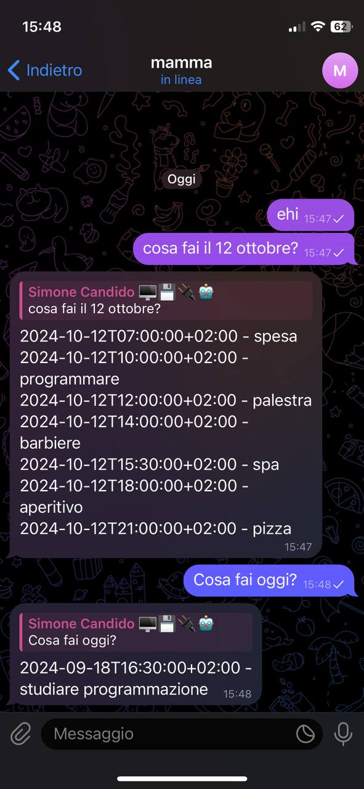

# Virtual Secretary Bot 🤖
 

## Table of Contents
1. [Description](#description)
2. [Features](#features)
3. [Documentation](#documentation)
   - [Google Calendar API Quickstart for Python](#google-calendar-api-quickstart-for-python)
   - [Parsing Human-Readable Date/Time Strings](#parsing-human-readable-datetime-strings)
   - [Google Translate API](#google-translate-api)
   - [Telethon for Telegram Userbot](#telethon-for-telegram-userbot)
   - [Google Calendar Automation in Python](#google-calendar-automation-in-python)
4. [Why Telethon?](#why-telethon)
5. [Installation](#installation)
6. [Usage](#usage)
7. [Configuration](#configuration)
8. [To Obtain Your Telegram Credentials](#to-obtain-your-telegram-credentials)
   - [Get API ID and API Hash](#1-get-api-id-and-api-hash)
   - [Get Your Telegram User ID](#2-get-your-telegram-user-id)
9. [Contributing](#contributing)
10. [License](#license)
11. [Contact](#contact)
12. [Screenshots](#screenshots)

## Description
The **Virtual Secretary Bot** is a Python-based automated application designed to respond to Telegram messages by checking availability in Google Calendar and replying based on scheduled events. It uses the Google Calendar API, `Telethon`, and natural language parsing with `parsedatetime` for a smooth interactive experience.

## Features
- Automatic Responses: Provides real-time updates on availability based on scheduled events.
- Natural Language Processing: Understands and processes queries like "Are you free now?" or "What do you have on [date]?"
- Google Calendar Integration: Retrieves events from the user's primary and secondary calendars.
- Multilingual Support: Translates user inputs to English for better parsing.
- Current Event Check: Notifies users if they are currently busy with an event.

## Documentation

- **Google Calendar API Quickstart for Python**:
  Learn how to set up and use the Google Calendar API with Python.
  [Google Calendar API Quickstart](https://developers.google.com/calendar/api/quickstart/python?hl=en)

- **Parsing Human-Readable Date/Time Strings**:
  Use the `parsedatetime` library to parse date and time strings.
  [Parsedatetime Library](https://github.com/bear/parsedatetime)

- **Google Translate API**:
  Guide on using Google Translate for translating text in Python.
  [Google Translate in Python](https://lokalise.com/blog/how-to-translate-languages-in-python-with-google-translate-and-deepl-plus-more/)

- **Telethon for Telegram Userbot**:
  Official documentation and GitHub repository for Telethon, the library used to interact with Telegram.
  [Telethon Documentation](https://docs.telethon.dev/en/stable/)
  [Telethon GitHub Repository](https://github.com/LonamiWebs/Telethon)

- **Google Calendar Automation in Python**:
  A video tutorial on automating Google Calendar with Python.
  [Google Calendar Automation Video](https://www.youtube.com/watch?v=B2E82UPUnOY)

## Why Telethon?

We chose **Telethon** for this project because it stands out as one of the few libraries that support the creation of userbots in Telegram. Unlike other libraries like `python-telegram-bot` or `aiogram`, which are primarily designed for creating bots that interact with Telegram's Bot API, Telethon allows us to interact with Telegram as a regular user. This capability is crucial for our use case, where the bot needs to respond to messages in a personal user context, not just within bot channels or groups. Telethon provides robust functionality for managing user interactions and accessing Telegram's full range of features, making it an ideal choice for implementing a userbot that integrates seamlessly with Google Calendar and other services.

## Installation

To set up this bot, follow these steps:

1. **Clone the Repository**:
   ```
   git clone https://github.com/SimoneMoreWare/virtual-secretary-bot.git
   ```

2. **Create a Virtual Environment**:
   ```
   python -m venv venv
   source venv/bin/activate  # On Windows, use `venv\Scripts\activate`
   ```

3. **Install Dependencies**:
   ```
   pip install -r requirements.txt
   ```

4. **Obtain API Credentials**:
    * Telegram API: Obtain your api_id and api_hash from Telegram [here](https://core.telegram.org/api/obtaining_api_id).
    * Google Calendar API: Follow the [quickstart guide](https://developers.google.com/calendar/api/quickstart/python?hl=en) to get your credentials.json.

5. **Configure Your Credentials**:
    * Replace the placeholder values in the script with your actual Telegram API credentials and Google Calendar credentials.
    * Ensure you have a credentials.json file for Google Calendar and a token.json file if you've previously authenticated.
    * Set up the bot by creating a `.env` file with the following parameters:
       ```
        TELEGRAM_API_ID=<your_api_id>
       TELEGRAM_API_HASH=<your_api_hash>
       GOOGLE_CALENDAR_ID=<your_calendar_id>
       ```


## Usage
Show examples of how to use the bot, including screenshots or commands.

1. Start the bot with:
   ```bash
   python bot.py
   ```
2. Send a message on Telegram, for example:
   - "Are you free now?"
   - "What is the next appointment?"

## Configuration
* Telegram Credentials:
     * Set api_id, api_hash, and phone_number in the script.
* Google Calendar API:
     * Ensure credentials.json is present in the project directory.
* User ID:
     * Set yourUser_id to your Telegram user ID.

## To obtain your Telegram credentials

### 1. Get API ID and API Hash
1. **Visit the Telegram API Development page**:
   - Go to [my.telegram.org](https://my.telegram.org).

2. **Log in with your Telegram account**:
   - You’ll need to enter your phone number and verify it via a code sent to your Telegram app.

3. **Create a new application**:
   - Once logged in, navigate to the "API Development Tools" section.
   - Fill out the form to create a new application. You will need to provide:
     - App title
     - Short name
     - URL (optional)
   - After creating the app, you will see your **API ID** and **API Hash**.
  
### 2. Get Your Telegram User ID

You can find your user ID using one of the following methods:

1. **Using a Telegram Bot**:
   - Search for the bot named **"userinfobot"** in Telegram and sent it a messagge. Bot replies with User ID information.

## Contributing
Feel free to fork the repository, create branches, and submit pull requests. Contributions to improve functionality or documentation are welcome.

## License
This project is licensed under the MIT License. See the [LICENSE](https://opensource.org/license/mit) file for details.

## Contact
For questions or issues, please open an issue on the GitHub repository or contact me at candidosimone598@gmail.com.

## Screenshots

