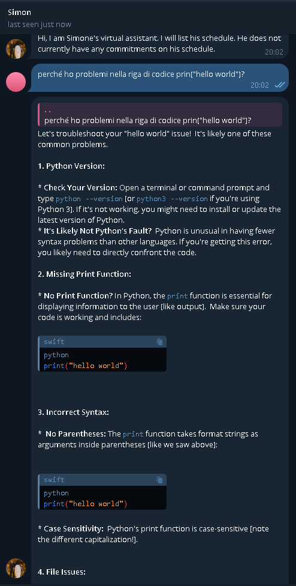

# Virtual Secretary Bot 🤖
 
&#x20;
## Table of Contents
1. [Description](#description)
2. [Features](#features)
3. [Documentation](#documentation)
   - [Google Calendar API Quickstart for Python](#google-calendar-api-quickstart-for-python)
   - [Parsing Human-Readable Date/Time Strings](#parsing-human-readable-datetime-strings)
   - [Google Translate API](#google-translate-api)
   - [Telethon for Telegram Userbot](#telethon-for-telegram-userbot)
   - [Google Calendar Automation in Python](#google-calendar-automation-in-python)
   - [Hugging Face Integration](#hugging-face-integration)
4. [Why Telethon?](#why-telethon)
5. [Hugging Face Integration](#Hugging-Face-Integration)
6. [Installation](#installation)
7. [Usage](#usage)
8. [Configuration](#configuration)
9. [To Obtain Your Telegram Credentials](#to-obtain-your-telegram-credentials)
   - [Get API ID and API Hash](#1-get-api-id-and-api-hash)
   - [Get Your Telegram User ID](#2-get-your-telegram-user-id)
10. [Contributing](#contributing)
11. [License](#license)
12. [Contact](#contact)
13. [Screenshots](#screenshots)

## Description
## The **Virtual Secretary Bot** is a Python-based automated application designed to respond to Telegram messages by checking availability in Google Calendar and replying based on scheduled events. It uses the Google Calendar API, Telethon, Hugging Face, and natural language parsing with parsedatetime for a smooth interactive experience.

## Features
- Automatic Responses: Provides real-time updates on availability based on scheduled events.
- Natural Language Processing: Understands and processes queries like "Are you free now?" or "What do you have on [date]?"
- Google Calendar Integration: Retrieves events from the user's primary and secondary calendars.
- Multilingual Support: Translates user inputs to English for better parsing.
- Current Event Check: Notifies users if they are currently busy with an event.
- AI-Powered Responses: Uses Hugging Face's Inference API for intelligent conversation capabilities.

## Documentation

- **Google Calendar API Quickstart for Python**:
  Learn how to set up and use the Google Calendar API with Python.
  [Google Calendar API Quickstart](https://developers.google.com/calendar/api/quickstart/python?hl=en)

- **Parsing Human-Readable Date/Time Strings**:
  Use the parsedatetime library to parse date and time strings.
  [Parsedatetime Library](https://github.com/bear/parsedatetime)

- **Google Translate API**:
  Guide on using Google Translate for translating text in Python.
  [Google Translate in Python](https://lokalise.com/blog/how-to-translate-languages-in-python-with-google-translate-and-deepl-plus-more/)

- **Telethon for Telegram Userbot**:
  Official documentation and GitHub repository for Telethon, the library used to interact with Telegram.
  [Telethon Documentation](https://docs.telethon.dev/en/stable/)
  [Telethon GitHub Repository](https://github.com/LonamiWebs/Telethon)

- **Google Calendar Automation in Python**:
  A video tutorial on automating Google Calendar with Python.
  [Google Calendar Automation Video](https://www.youtube.com/watch?v=B2E82UPUnOY)

- **Hugging Face Integration**:
  This bot now integrates with Hugging Face's Inference API to provide AI-powered responses to Telegram messages.
  [Hugging Face Inference API](https://huggingface.co/docs/api-inference/index)

## Why Telethon?

We chose **Telethon** for this project because it stands out as one of the few libraries that support the creation of userbots in Telegram. Unlike other libraries like `python-telegram-bot` or `aiogram`, which are primarily designed for creating bots that interact with Telegram's Bot API, Telethon allows us to interact with Telegram as a regular user. This capability is crucial for our use case, where the bot needs to respond to messages in a personal user context, not just within bot channels or groups. Telethon provides robust functionality for managing user interactions and accessing Telegram's full range of features, making it an ideal choice for implementing a userbot that integrates seamlessly with Google Calendar and other services.

## Hugging Face Integration

Hugging Face is a leading platform for machine learning models, specializing in natural language processing (NLP) and AI-powered applications. It provides an extensive library of pre-trained models and APIs that allow developers to integrate AI functionalities seamlessly into their applications. One of the key features of Hugging Face is the `InferenceClient`, which enables users to interact with models hosted on the Hugging Face Hub, such as `google/gemma-2-2b-it`.

## Installation

To set up this bot, follow these steps:

1. **Clone the Repository**:

   ```bash
   git clone https://github.com/SimoneMoreWare/virtual-secretary-bot.git
   ```

2. **Create a Virtual Environment**:

   ```bash
   python -m venv venv
   source venv/bin/activate  # On Windows, use `venv\Scripts\activate`
   ```

3. **Install Dependencies**:

   ```bash
   pip install -r requirements.txt
   ```

4. **Obtain API Credentials**:

   - Telegram API: Obtain your api\_id and api\_hash from Telegram [here](https://core.telegram.org/api/obtaining_api_id).
   - Google Calendar API: Follow the [quickstart guide](https://developers.google.com/calendar/api/quickstart/python?hl=en) to get your credentials.json.
   - Hugging Face API: Obtain an API key from [Hugging Face](https://huggingface.co/settings/tokens) and ensure you have access to the model `google/gemma-2-2b-it`.

5. **Configure Your Credentials**:

   - Replace the placeholder values in the script with your actual Telegram API credentials, Google Calendar credentials, and Hugging Face API key.
   - Ensure you have a credentials.json file for Google Calendar and a token.json file if you've previously authenticated.
   - Set up the bot by creating a `.env` file with the following parameters:
     ```bash
     TELEGRAM_API_ID=<your_api_id>
     TELEGRAM_API_HASH=<your_api_hash>
     GOOGLE_CALENDAR_ID=<your_calendar_id>
     HF_API_KEY=<your_huggingface_api_key>
     ```

## Usage
Show examples of how to use the bot, including screenshots or commands.

1. Start the bot with:
   ```bash
   python bot.py
   ```
2. Send a message on Telegram, for example:
    - "Are you free now?": The bot checks for current events and responds with availability.
    - "What is the next appointment?": The bot retrieves the next scheduled event.
    - "What do you have on [date]?": The bot provides a list of events for the specified date.
    - "Ask me anything": The bot responds using the Hugging Face google/gemma-2-2b-it model, providing general answers to your questions.
    - "Summarize this text": The bot can generate concise summaries of provided text using the Hugging Face model.
    - "Generate a meeting summary": If you provide meeting notes, the bot can use Hugging Face's model to summarize them.

## Configuration
* Telegram Credentials:
     * Set api_id, api_hash, and phone_number in the script.
* Google Calendar API:
     * Ensure credentials.json is present in the project directory.
* Hugging Face Integration:
     * The bot leverages the `google/gemma-2-2b-it` model from Hugging Face for text generation and summarization.
     * Ensure the `transformers` library is installed: `pip install transformers`.
     * If needed, set up your Hugging Face API token in the script.       
* User ID:
     * Set yourUser_id to your Telegram user ID.

## To obtain your Telegram credentials

### 1. Get API ID and API Hash
1. **Visit the Telegram API Development page**:
   - Go to [my.telegram.org](https://my.telegram.org).

2. **Log in with your Telegram account**:
   - You’ll need to enter your phone number and verify it via a code sent to your Telegram app.

3. **Create a new application**:
   - Once logged in, navigate to the "API Development Tools" section.
   - Fill out the form to create a new application. You will need to provide:
     - App title
     - Short name
     - URL (optional)
   - After creating the app, you will see your **API ID** and **API Hash**.
  
### 2. Get Your Telegram User ID

You can find your user ID using one of the following methods:

1. **Using a Telegram Bot**:
   - Search for the bot named **"userinfobot"** in Telegram and sent it a messagge. Bot replies with User ID information.

## Contributing
Feel free to fork the repository, create branches, and submit pull requests. Contributions to improve functionality or documentation are welcome. If you have specific coding standards or testing procedures, please adhere to them:
*  Ensure all code adheres to [PEP 8](https://www.python.org/dev/peps/pep-0008/) for Python styling.
*  Include tests for any new features or bug fixes.
*  Update the documentation accordingly.
    
## License
This project is licensed under the MIT License. See the [LICENSE](https://opensource.org/license/mit) file for details.

## Contact
For questions or issues, please open an issue on the GitHub repository or contact me at candidosimone598@gmail.com. You can also check my [GitHub profile](https://github.com/SimoneMoreWare) for more projects and updates.

## Screenshots



